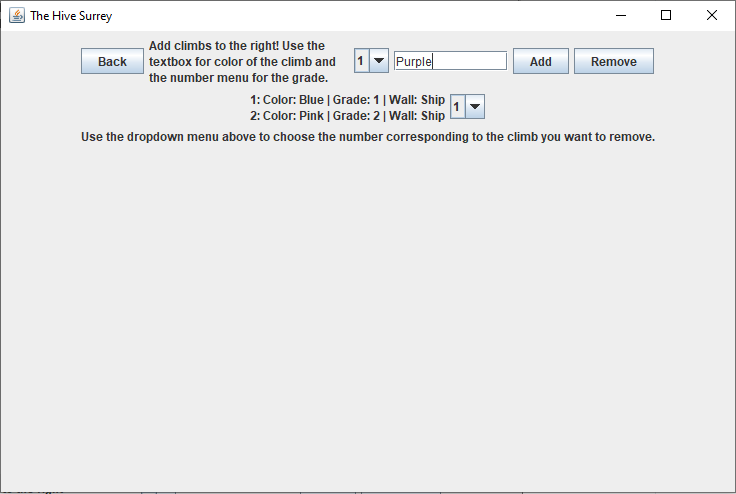
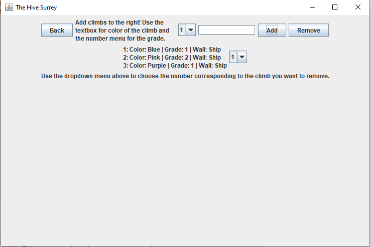

# CPSC 210 Personal Project: Climb Tracker for the Climbing Gym

**Main Screen**  

**Example of adding a climb**  

**After adding a climb**  

## Project Proposal

The goal of this application is to provide an interface for a user to track climbs
in the rock climbing gym and add/remove climbs as they are set or removed. The grading scale used in 
 this program is made
for *The Hive Climbing*.

This project is of interest to me because I am an avid rock climber. However, when I went to
the gym for the first time, and whenever I go to a different gym, I find the
amount of climbs and lack of organization annoying. There is never any documentation on the climbs that
 is all in once place.
 I think an application that could sort climbs 
and provide a map of where they are in the gym would be useful to newcomers.

## User Stories

- As a user, I want to be able to sort climbs in terms of their difficulty.

- As a user, I want to be able to add new climbs to the gym.

- As a user, I want to be able to see only climbs that are a specific difficulty

- As a user, I want to be able to see all the climbs in the gym, grouped together by wall.

- As a user, I want to be able to remove climbs from the gym.

- As a user, I want to be able to save the list of climbs to a file.

- As a user, I want to be able to load the list of climbs when the program starts.

